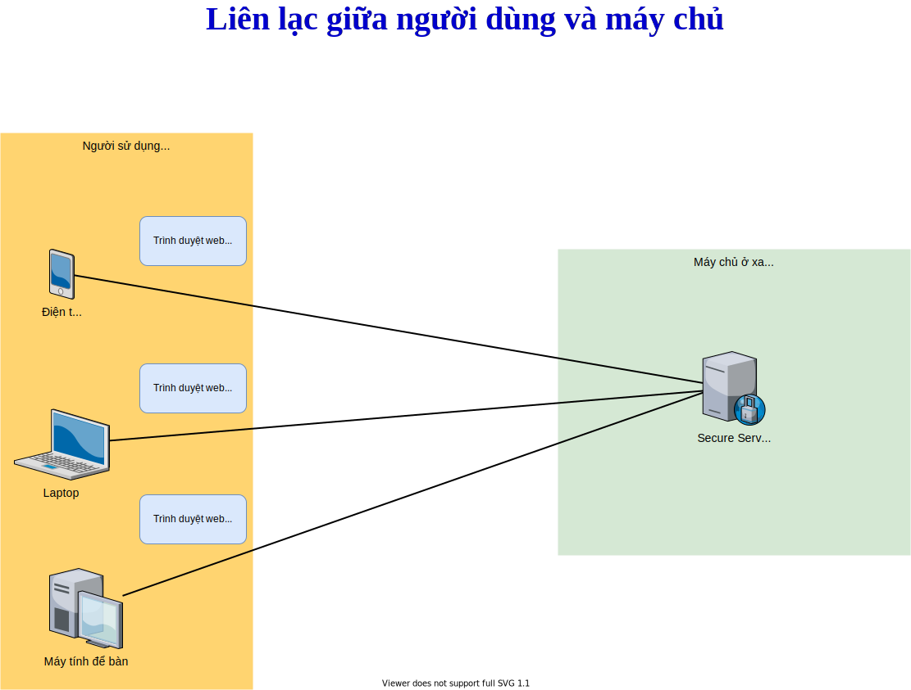

## 2. Liên lạc giữa người dùng và máy chủ

- Người sử dụng điện thoại, máy tính laptop, máy tính để bàn khi sử dụng trình duyệt web như Google Chrome, Firefox, Internet Explorer, Safari v.v khi đăng nhập một địa chỉ trang web, trình duyệt sẽ tạo kết nối và gửi yêu cầu đến máy chủ (server) ở xa.
- Máy chủ sẽ gửi nội dung trang web đến cho chương trình trình duyệt, chương trình trình duyệt sẽ hiển thị cho người sử dụng

