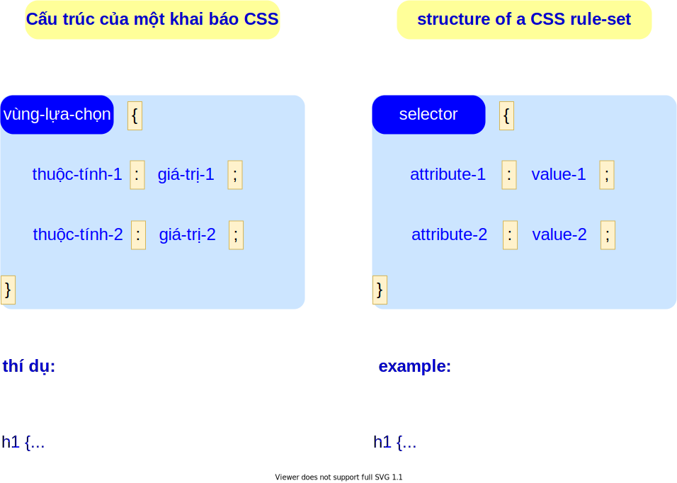

## Cấu trúc của CSS

- Bạn có thể ví các thẻ HTMl là hình vẽ mộc, chỉ thể hiện nội dung, còn CSS là sự trang điểm cho các thẻ và cho trang web.
- CSS mô tả cách hiển thị của trang web như bố cục (layout), màu sắc (color), hiệu ứng chuyển động (animation), cách thể hiện nội dung trên các màn hình kích thước khác nhau như trên máy tính, iphone, ipad v.v.
- Các mô tả hiển thị được gọi là luật (rule) và nó dùng để áp dụng lên một hay nhiêu thẻ HTML. Cấu trúc khai báo luật trong CSS như sau:

  

- CSS có thể được: 
  - định nghĩa trực tiếp trong thẻ HTML (tiếng Anh là inline-style). Phần định nghĩa nằm trong phần `style="..."`, thí dụ như sau:
      ```html
      <h1 style="color: blue; text-align: center;">Tiêu đề</h1>
      ```
  - định nghĩa trong phần `<head>` của trang web và nằm trong thẻ `<style> ... </style>`, thí dụ như:
    ```html
    <head>
      <style>
        h1 {
          color: blue;
          text-align: center;
        }
      </style>
    </head>    
    ```
  - định nghĩa trong một file riêng rẽ (external). Nó được khai báo trong thẻ `<link>` ở phần `<head>` như sau: `<link rel="stylesheet" type="text/css" href="file-name.css">`, thí dụ như:
    ```html
    <head>
      <link rel="stylesheet" type="text/css" href="my-style.css">
    </head>    
    ```
    và trong file css sẽ chứa các luật miêu tả.


- [bấm vào đây để đến đường dẫn của bài học và thực hành](https://codesandbox.io/s/github/legiaquangvn/HTML-tutorial/tree/master/3-A-CSS-Structure) 
  - trên browser, copy and paste link [`https://1ufq1.csb.app/my-page.html`](https://1ufq1.csb.app/my-page.html) để xem trang web.
